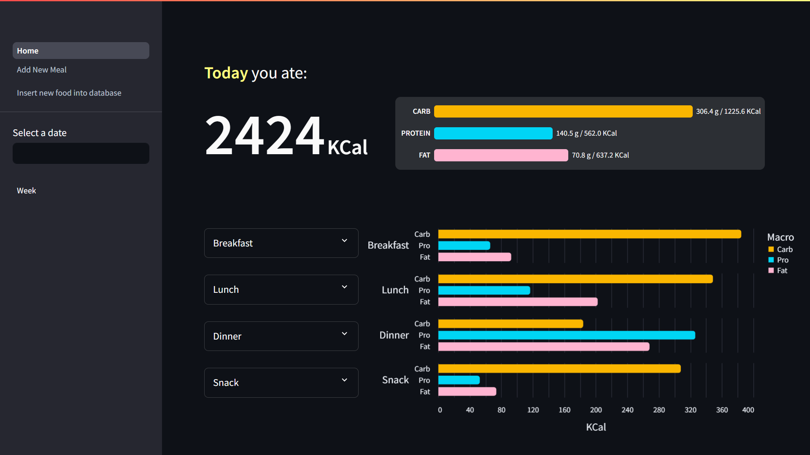

# Calorie Tracker


## Description
***Calorie Tracker  *** is a web application to help user track daily and weekly calories intake.

## Installation
1. Clone the repositoy:

    ```bash
    git clone https://github.com/SalerSimo/Calorie-Tracker
    cd Calorie-Tracker
    ```
2. Install required Python packages:
    ```bash
    pip install -r requirements.txt
    ```
## Usage
- #### Windows:  
    Run file `run.bat`.
- #### Linux:  
    Run file `run.sh`.

Or write in command line:

```bash
streamlit run Run.py
```
